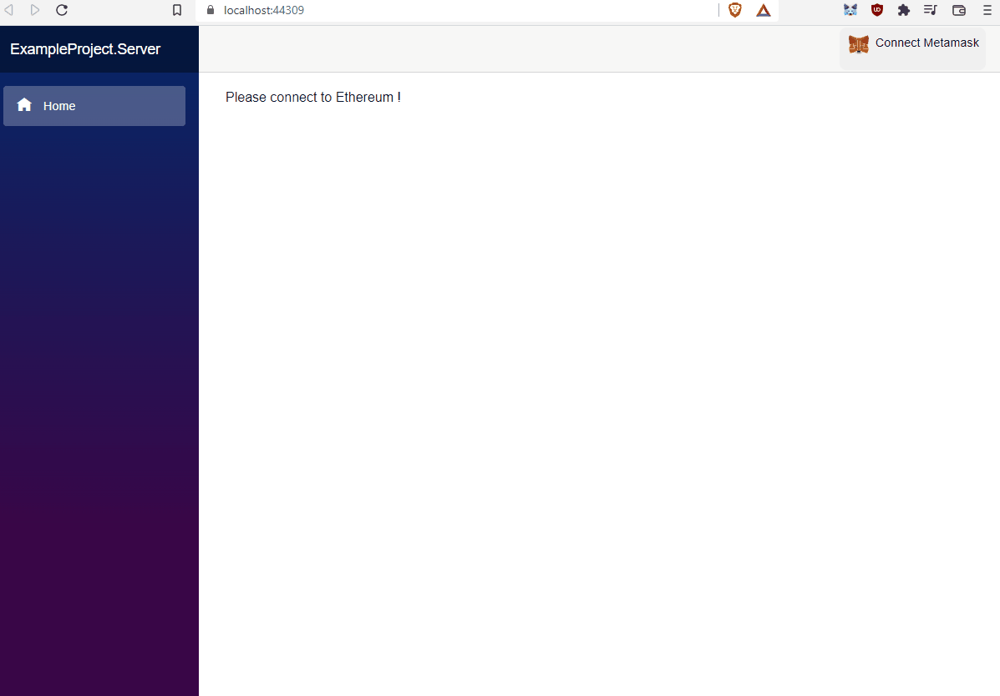

# JeffyJeff's fork of Juan Blanco's Nethereum SIWE Template 

## Abstract
The Nethereum SIWE template provides an starting point of signing and authentication using Ethereum accounts and the standard SIWE message.
The templates provides the following use cases, and how SIWE can be implemented using the Nethereum libraries.
+ Rest Api - This .NET Core Web Api is a standalone REST API that acts as an identity provider



## SIWE Message, signing and recovery (Overall process)

A SIWE Message is a standard message that a user signs with their private key, the message is presented in plain text to the user. The message contains different attributes including the Domain, Address, Uri, Expiry etc. The issuer of the message can authenticate the signer (user), by matching the recovered address from the signed message to their user records. To prevent replay attacks a unique nonce (random value) is created for each session.

More information can be found here https://eips.ethereum.org/EIPS/eip-4361

```csharp
public class SiweMessage
    {
        /// <summary>
        /// RFC 4501 dns authority that is requesting the signing.
        /// </summary>
        public string Domain { get; set; }

        /// <summary>
        /// Ethereum address performing the signing conformant to capitalization
        /// encoded checksum specified in EIP-55 where applicable.
        /// </summary>
        public string Address { get; set; }

        /// <summary>
        /// Human-readable ASCII assertion that the user will sign, and it must not contain `\n`. 
        /// </summary>
        public string Statement { get; set; }

        /// <summary>
        /// RFC 3986 URI referring to the resource that is the subject of the signing
        /// (as in the __subject__ of a claim).
        /// </summary>
        public string Uri { get; set; }

        /// <summary>
        /// Current version of the message. 
        /// </summary>
        public string Version { get; set; }

        /// <summary>
        /// Randomized token used to prevent replay attacks, at least 8 alphanumeric characters. 
        /// </summary>
        public string Nonce { get; set; }

        /// <summary>
        ///  ISO 8601 datetime string of the current time. 
        /// </summary>
        public string IssuedAt { get; set; }

        /// <summary>
        /// ISO 8601 datetime string that, if present, indicates when the signed authentication message is no longer valid. 
        /// </summary>
        public string ExpirationTime { get; set; }

        /// <summary>
        /// ISO 8601 datetime string that, if present, indicates when the signed authentication message will become valid. 
        /// </summary>
        public string NotBefore { get; set; }

        /// <summary>
        /// System-specific identifier that may be used to uniquely refer to the sign-in request
        /// </summary>
      
        public string RequestId { get; set; }

        /// <summary>
        /// EIP-155 Chain ID to which the session is bound, and the network where, Contract Accounts must be resolved
        /// </summary>
        public string ChainId { get; set; }

        /// <summary>
        /// List of information or references to information the user wishes to have resolved as part of authentication by the relying party. They are expressed as RFC 3986 URIs separated by `\n- `
        /// </summary>
        public List<string> Resources { get; set; }

```

## Rest Api 
The Rest Api sample template demonstrates the following:

### Generate a new Siwe message with a random Nonce

To generate a new siwe message a DefaultSiweMessage class is in place, here you can put your website, statement, expiry, etc
The message is created using the Nethereum SiweMessageService that has been configured with the default [InMemorySessionNonceStorage](https://github.com/Nethereum/Nethereum/blob/master/src/Nethereum.Siwe/InMemorySessionNonceStorage.cs), which is used to store and validate SIWE messages mapped to their nonces as unique identifier. This can be replaced with your custom repository that implements ISessionStorage.
The Nonce is randomly generated by Nethereum using the SiweMessageService.

```csharp
[AllowAnonymous]
[HttpPost("message")]
[ProducesResponseType(StatusCodes.Status200OK)]
[ProducesResponseType(StatusCodes.Status400BadRequest)]
public IActionResult GenerateNewSiweMessage([FromBody] string address)
{
  var addressUtil = new AddressUtil();
  var isValid = addressUtil.IsValidEthereumAddressHexFormat(address);

  if (!isValid)
  {
    ModelState.AddModelError("InvalidAddress", "Invalid Address");
    return BadRequest(ModelState);
  }

  var message = new DefaultSiweMessage();
  message.SetExpirationTime(DateTime.Now.AddMinutes(10));
  message.SetNotBefore(DateTime.Now);
  message.Address = address.ConvertToEthereumChecksumAddress();
  return Ok(_siweMessageService.BuildMessageToSign(message));
}
````

### Authenticating a User
To authentication a user, the signed message will be sent to the Rest API. 
In this example the whole message is validated as follows:

```csharp
[AllowAnonymous]
[HttpPost("authenticate")]
[ProducesResponseType(StatusCodes.Status200OK)]
[ProducesResponseType(StatusCodes.Status400BadRequest)]
[ProducesResponseType(StatusCodes.Status401Unauthorized)]
public async Task<IActionResult> Authenticate(AuthenticateRequest authenticateRequest)
{
  var siweMessage = SiweMessageParser.Parse(authenticateRequest.SiweEncodedMessage);
  var signature = authenticateRequest.Signature;
  var validUser = await _siweMessageService.IsUserAddressRegistered(siweMessage);
  if (validUser)
  {
    if (await _siweMessageService.IsMessageSignatureValid(siweMessage, signature))
    {
      if (_siweMessageService.IsMessageTheSameAsSessionStored(siweMessage))
      {
        if (_siweMessageService.HasMessageDateStartedAndNotExpired(siweMessage))
        {
          var token = _siweJwtAuthorisationService.GenerateToken(siweMessage, signature);
          return Ok(new AuthenticateResponse
          {
            Address = siweMessage.Address,
            Jwt = token
          });
        }
        ModelState.AddModelError("Unauthorized", "Expired token");
        return Unauthorized(ModelState);
      }
      ModelState.AddModelError("Unauthorized", "Matching Siwe message with nonce not found");
      return Unauthorized(ModelState);
    }
    ModelState.AddModelError("Unauthorized", "Invalid Signature");
    return Unauthorized(ModelState);
  }

  ModelState.AddModelError("Unauthorized", "Invalid User");
  return Unauthorized(ModelState);
}

```
### Loggin out a User
To log out, you must be authenticated. This is why there is no [AllowAnonymous] attribute here.
```csharp
[HttpPost("logout")]
[ProducesResponseType(StatusCodes.Status200OK)]
[ProducesResponseType(StatusCodes.Status401Unauthorized)]
public IActionResult LogOut()
{
  var siweMessage = SiweJwtMiddleware.GetSiweMessageFromContext(HttpContext);
  _siweMessageService.InvalidateSession(siweMessage);
  return Ok();
}
```

### Obtaining an authenticated User
To get the authenticated user (yourself), you must be authenticated (of course) and call this endpoint
```csharp
[HttpGet("user")]
[ProducesResponseType(StatusCodes.Status200OK)]
[ProducesResponseType(StatusCodes.Status403Forbidden)]
public IActionResult GetAuthenticatedUser()
{
  //ethereum wallet address
  var address = SiweJwtMiddleware.GetEthereumAddressFromContext(HttpContext);

  if (address != null)
  {
    //First get user claims
    var claims = ClaimsPrincipal.Current?.Identities.First().Claims.ToList();

    //Filter specific claims
    var username = claims?.FirstOrDefault(x => x.Type.Equals("UserName", StringComparison.OrdinalIgnoreCase))?.Value;
    var email = claims?.FirstOrDefault(x => x.Type.Equals("Email", StringComparison.OrdinalIgnoreCase))?.Value;

    return Ok(new User { Username = username, Email = email, WalletAddress = address });
  }

  //this should not happen
  return Forbid();
}


```
### IUserService
The first check validates the user is registered (or valid) using Nethereum IUserService ``` var validUser = await _siweMessageService.IsUserAddressRegistered(siweMessage);```.
Your user service can validate the user is a registered user in a smart contract or internal database.
Nethereum provides a preset ERC721BalanceEthereumUserService, that validates that the user has an ERC721 token (NFT balance) https://github.com/Nethereum/Nethereum/blob/master/src/Nethereum.Siwe/UserServices/ERC721BalanceEthereumUserService.cs

### Creation of a JWT
To enable the reusability of other JWT middleware we create a JWT that stores the values of the SIWE message and uses the same expiration, issuance, etc of the SiweMessage.

DateTimes are stored for both SIWE and the JWT due to precission issues on milliseconds. JWT are defaulted to 0, so we won't be able to recreate the message to validate the signature.

Notice that you absolutely need to set your JWT Key, Issuer and Audience here. These are configured in the appsettings.json file

```csharp
public string GenerateToken(SiweMessage siweMessage, string signature)
  {
    var issuer = Configuration["Jwt:Issuer"];
    var audience = Configuration["Jwt:Audience"];
    var tokenHandler = new JwtSecurityTokenHandler();
    var key = Encoding.ASCII.GetBytes(_appSettings.Secret);
    var tokenDescriptor = new SecurityTokenDescriptor
    {
      Issuer = issuer,
      Audience = audience,
      Subject = new ClaimsIdentity(new[] {
                                            new Claim(ClaimTypeAddress, siweMessage.Address) ,
                                            new Claim(ClaimTypeNonce, siweMessage.Nonce),
                                            new Claim(ClaimTypeSignature, signature),
                                            new Claim(ClaimTypeSiweExpiry, siweMessage.ExpirationTime),
                                            new Claim(ClaimTypeSiweIssuedAt, siweMessage.IssuedAt),
                                            new Claim(ClaimTypeSiweNotBefore, siweMessage.NotBefore),
                                          }),

      SigningCredentials = new SigningCredentials(new SymmetricSecurityKey(key), SecurityAlgorithms.HmacSha256Signature)
    };
    if (!string.IsNullOrEmpty(siweMessage.ExpirationTime))
    {
      tokenDescriptor.Expires = GetIso8602AsDateTime(siweMessage.ExpirationTime);
    }
    if (!string.IsNullOrEmpty(siweMessage.IssuedAt))
    {
      tokenDescriptor.IssuedAt = GetIso8602AsDateTime(siweMessage.IssuedAt);
    }
    if (!string.IsNullOrEmpty(siweMessage.NotBefore))
    {
      tokenDescriptor.NotBefore = GetIso8602AsDateTime(siweMessage.NotBefore);
    }

    var token = tokenHandler.CreateToken(tokenDescriptor);
    return tokenHandler.WriteToken(token);
  }
```

### Validation of a JWT using the Middleware
Here the validation is done for both the JWT and the SIWE message that is reconstructed with the values from the JWT and validated against the signature, and generic validations

If wanted here other validations could be checked per request like ```IsUserAddressRegistered``` if checking the balance of an NFT or just simply user registration in a db.
```csharp
public async Task<SiweMessage> ValidateToken(string token)
  {
    if (token == null)
      return null;

    var tokenHandler = new JwtSecurityTokenHandler();
    var key = Encoding.ASCII.GetBytes(_appSettings.Secret);
    try
    {
      tokenHandler.ValidateToken(token, new TokenValidationParameters
      {
        ValidateIssuerSigningKey = true,
        IssuerSigningKey = new SymmetricSecurityKey(key),
        ValidateIssuer = false,
        ValidateAudience = false,
        // set clockskew to zero so tokens expire exactly at token expiration time (instead of 5 minutes later)
        ClockSkew = TimeSpan.Zero
      }, out SecurityToken validatedToken);

      var jwtToken = (JwtSecurityToken)validatedToken;
      var address = jwtToken.Claims.First(x => x.Type == ClaimTypeAddress).Value;
      var nonce = jwtToken.Claims.First(x => x.Type == ClaimTypeNonce).Value;
      var issuedAt = jwtToken.Claims.First(x => x.Type == ClaimTypeSiweIssuedAt).Value;
      var expiry = jwtToken.Claims.First(x => x.Type == ClaimTypeSiweExpiry).Value;
      var notBefore = jwtToken.Claims.First(x => x.Type == ClaimTypeSiweNotBefore).Value;

      var signature = jwtToken.Claims.First(x => x.Type == ClaimTypeSignature).Value;

      var siweMessage = new DefaultSiweMessage
      {
        Address = address,
        Nonce = nonce,
        ExpirationTime = expiry,
        IssuedAt = issuedAt,
        NotBefore = notBefore
      };

      Debug.WriteLine(SiweMessageStringBuilder.BuildMessage(siweMessage));
      if (await _siweMessageService.IsMessageSignatureValid(siweMessage, signature))
      {
        if (_siweMessageService.IsMessageTheSameAsSessionStored(siweMessage))
        {
          if (_siweMessageService.HasMessageDateStartedAndNotExpired(siweMessage))
          {
            return siweMessage;
          }
        }
      }

      return null;
    }
    catch
    {
      // return null if validation fails
      return null;
    }
  }
```


### The JWT validation Middleware
The invoke method is an important part of the .NET Core middleware pipeline. It is invoked each time a HTTP request is made and passed through the pipeline. This allows developers to create custom logic for handling requests, such as authentication, authorization, logging and caching. 
```csharp
public class SiweJwtMiddleware
{
    private readonly RequestDelegate _next;
    public const string ContextEthereumAddress = "ethereumAddress";
    public const string ContextSiweMessage = "siweMessage";

    public static string? GetEthereumAddressFromContext(HttpContext context)
    {
        if (context.Items.ContainsKey(ContextEthereumAddress))
        {
            return (string)context.Items[ContextEthereumAddress]!;
        }

        return null;
    }

    public static SiweMessage? GetSiweMessageFromContext(HttpContext context)
    {
        if (context.Items.ContainsKey(ContextSiweMessage))
        {
            return (SiweMessage)context.Items[ContextSiweMessage]!;
        }

        return null;
    }

    public static void SetSiweMessage(HttpContext context, SiweMessage siweMessage)
    {
        context.Items[ContextSiweMessage] = siweMessage;
    }

    public static void SetEthereumAddress(HttpContext context, string address)
    {
        context.Items[ContextEthereumAddress] = address;
    }

    public SiweJwtMiddleware(RequestDelegate next)
    {
        _next = next;
    }

    public async Task InvokeAsync(HttpContext context, ISiweJwtAuthorisationService siweJwtAuthorisation)
    {
        var token = context.Request.Headers["Authorization"].FirstOrDefault()?.Split(" ").Last();
        var siweMessage = await siweJwtAuthorisation.ValidateToken(token);
        if (siweMessage != null)
        {
            SetEthereumAddress(context, siweMessage.Address);
            SetSiweMessage(context, siweMessage);
        }

        await _next(context);
    }
}
```

### Setting up the Middleware in .NET Core
The UseMiddleware in .NET Core allows developers to create the application pipeline. Through this feature, developers can invoke middleware components in the pipeline of an http request. 

```csharp
app.UseMiddleware<SiweJwtMiddleware>();
```
